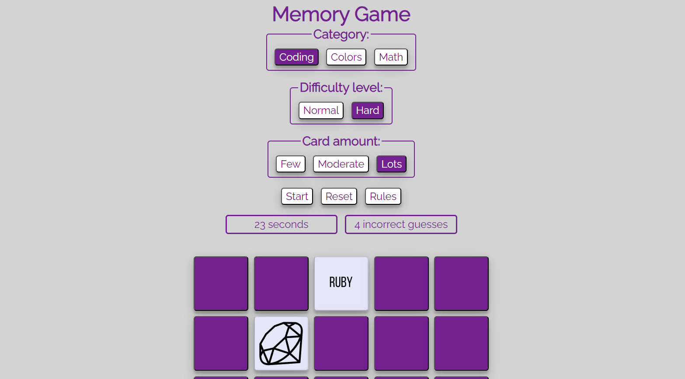

![Vercel][Vercel]
![last commit][last-commit]
![issues open][issues-open]
![github stars][stars]

<h1><strong>Memory Game</strong></h1>

Memory Game is a Jamstack web-app developed using [React](react-url) and [SCSS](sass-url) to create a responsive, optimized interface. Users can choose from three different card decks, two different difficulty levels, and from three card amounts.  The user clicks on any two cards and they flip over to show what their face is, if they match they stay visible, otherwise they'll flip back over.  A timer lets the user know how much time has passed, and a counter shows how many incorrect guesses they've made.

  
Table of Contents

  <ul>
        <li><a href='#about-the-project'>About The Project</a></li>
        <ul>
            <li><a href='#current-features'>Current Features</a></li>
            <li><a href='#updates-from-v1'>Updates from V1</a></li>
            <li><a href='#built-with'>Built With</a></li>
            <li><a href='#tested-on'>Tested On</a></li>
        </ul>
        <li><a href='#feedback'>Feedback</a></li>
        <li><a href='#contact'>Contact</a></li>
        <li><a href='#acknowledgements'>Acknowledgements</a></li>
    </ul>

## <strong>About The Project</strong>

 

![repo size][repo-size]
![language count][language-count]
![main language][main-language]

### <strong>Current Features</strong>
- Users can pick a normal or difficult game
- Animation shows card flip
- Checks prevent game from starting without deck, category and card count selections

### <strong>Updates from V1</strong>
- Switched database host
- Create new card faces for improved contrast
- Added utilities and constants
- Created more components for much cleaner code

 

### <strong>Built With</strong>

[![React][react.js]][react-url]
[![Sass][sass]][sass-url]

### <strong>Tested On</strong>

[![Chrome][chrome]][chrome-url]

(<a href='#top'>back to top</a>)

### <strong>Dependencies</strong>
***
- [react](https://www.npmjs.com/package/react)
- [react-dom](https://www.npmjs.com/package/react-dom)
- [vite](https://www.npmjs.com/package/vite)
- [sass](https://www.npmjs.com/package/sass)
- [appwrite](https://www.npmjs.com/package/appwrite)

(<a href='#top'>back to top</a>)

## <strong>Feedback</strong>

As my cats and dog aren't too keen on providing input on my projects, feel free to [send me a message](https://www.achulslander.com/#contact) if you have some constructive comments, or [file an issue](https://github.com/alleycaaat/memory-card-game/issues/new) if I really buggered something up.

(<a href='#top'>back to top</a>)

## <strong>Contact</strong>

AC Hulslander - [Send me a message](https://www.achulslander.com/#contact)

[![GitHub][github]](https://github.com/alleycaaat/)
[![hashnode][hashnode]][hashnode-url]
[![linkedin][linkedin]][linkedin-url]
[![discord][discord]][discord-url]
[![codepen][codepen]][codepen-url]
[![twitter][twitter]][twitter-url]

(<a href='#top'>back to top</a>)

## <strong>Acknowledgements</strong>

- [Img Shields](https://shields.io/)
- [Appwrite docs](https://appwrite.io/docs)

(<a href='#top'>back to top</a>)

[Vercel]: https://vercelbadge.vercel.app/api/alleycaaat/memory-card-game

[issues-open]: https://img.shields.io/github/issues/alleycaaat/memory-card-game?color=blue&logo=github

[repo-size]: https://img.shields.io/github/repo-size/alleycaaat/memory-card-game?color=red&logo=github

[language-count]: https://img.shields.io/github/languages/count/alleycaaat/memory-card-game?color=orange&logo=github

[main-language]: https://img.shields.io/github/languages/top/alleycaaat/memory-card-game?color=yellow&logo=github

[last-commit]: https://img.shields.io/github/last-commit/alleycaaat/memory-card-game?logo=github

[stars]: https://img.shields.io/github/stars/alleycaaat/memory-card-game?color=purple&logo=github

[linkedin]: https://img.shields.io/badge/-LinkedIn-black.svg?style=for-the-badge&logo=linkedin&colorB=555
[linkedin-url]: https://linkedin.com/in/achulslander

[product-screenshot]: images/screenshot.png

[react.js]: https://img.shields.io/badge/React-20232A?style=for-the-badge&logo=react&logoColor=61DAFB
[react-url]: https://reactjs.org/

[sass]: https://img.shields.io/badge/Sass-CC6699?style=for-the-badge&logo=sass&logoColor=white
[sass-url]: https://sass-lang.com/

[chrome]: https://img.shields.io/badge/Google_chrome-4285F4?style=for-the-badge&logo=Google-chrome&logoColor=white
[chrome-url]: https://www.google.com/chrome/

[github]: https://img.shields.io/badge/GitHub-100000?style=for-the-badge&logo=github&logoColor=white

[codepen]: https://img.shields.io/badge/Codepen-000000?style=for-the-badge&logo=codepen&logoColor=white
[codepen-url]: https://codepen.io/alleycaaat

[twitter]: https://img.shields.io/badge/Twitter-1DA1F2?style=for-the-badge&logo=twitter&logoColor=white
[twitter-url]: https://twitter.com/achulslander

[hashnode]: https://img.shields.io/badge/Hashnode-2962FF?style=for-the-badge&logo=hashnode&logoColor=white
[hashnode-url]: https://hashnode.com/@alleycaaat

[discord]:https://img.shields.io/badge/Discord-7289DA?style=for-the-badge&logo=discord&logoColor=white
[discord-url]: https://discordapp.com/users/427569685366833174
